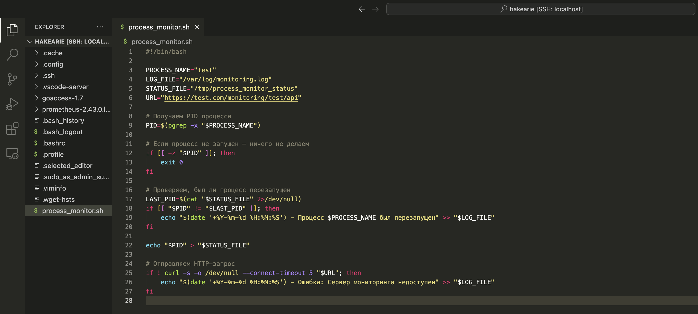
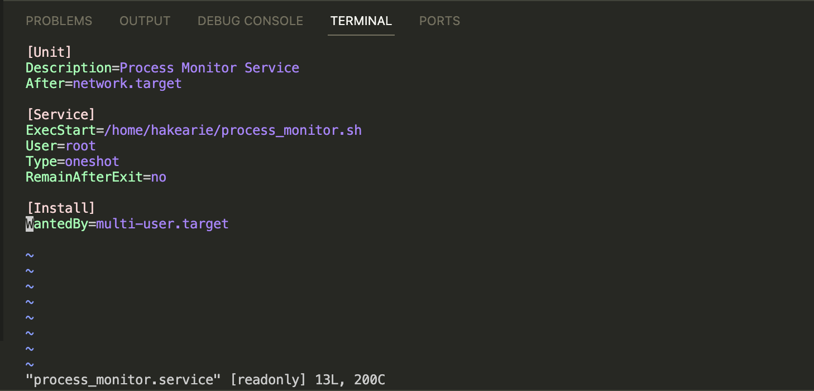
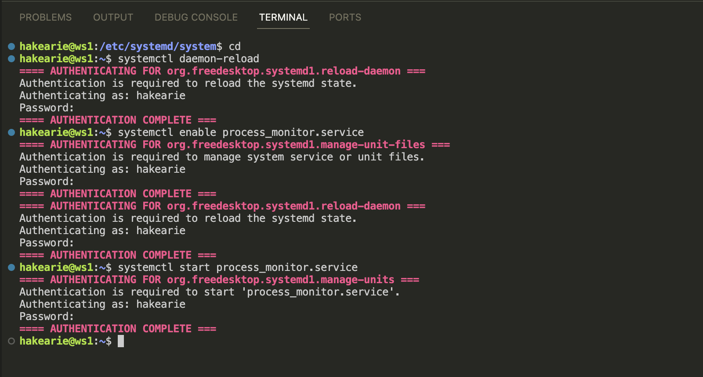
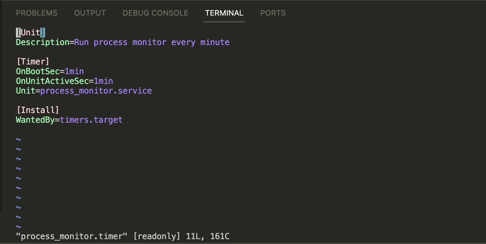
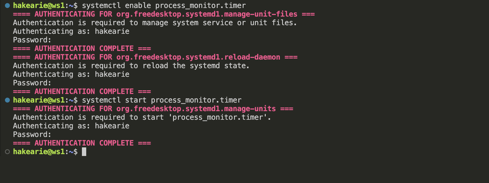
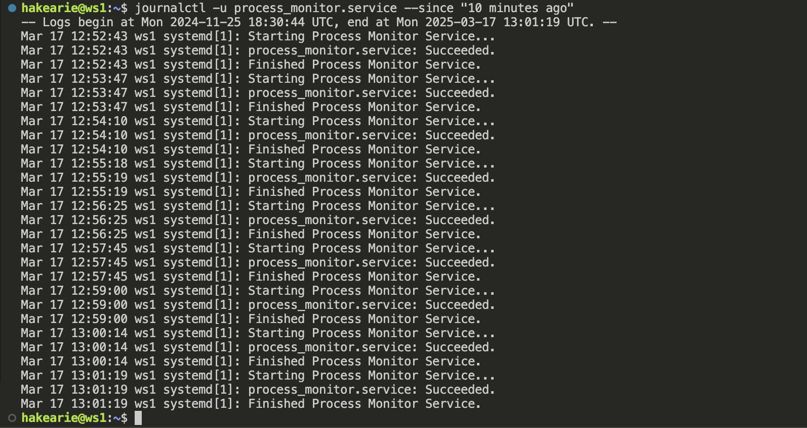
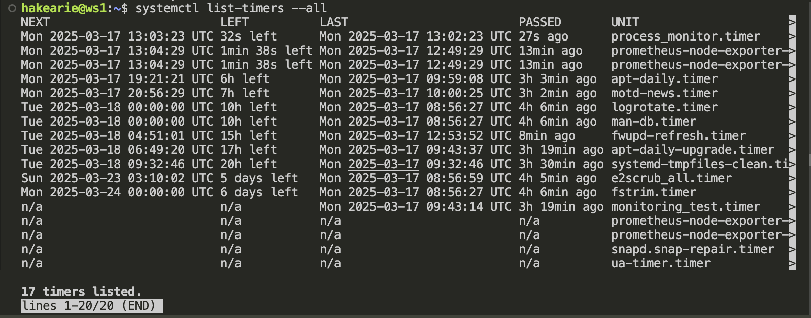
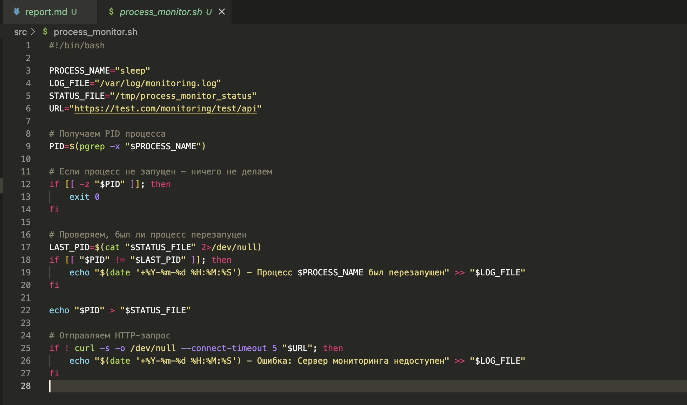
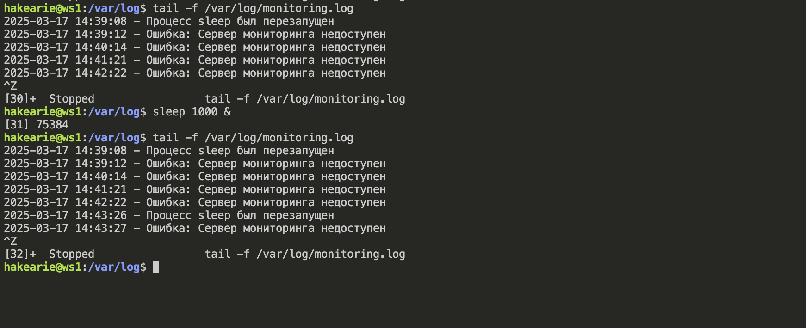

# Отчет о проделанной работе

## Цель работы
Написать скрипт на bash для мониторинга процесса test в среде linux.

Скрипт должен отвечать следующим требованиям:
- Запускаться при запуске системы (предпочтительно написать юнит systemd в дополнение к скрипту)
- Отрабатывать каждую минуту
- Если процесс запущен, то стучаться(по https) на https://test.com/monitoring/test/api
- Если процесс был перезапущен, писать в лог /var/log/monitoring.log (если процесс не запущен, то ничего не делать) 
- Если сервер мониторинга не доступен, так же писать в лог.

### Написание Bash-скрипта
Bash-скрипт находится [ТУТ](./process_monitor.sh)

### Создание systemd-юнита
Этот юнит запускает process_monitor.sh при старте системы.

Затем активируем и запускаем сервис.

### Создание systemd таймера
Чтобы скрипт выполнялся каждую минуту, используем таймер systemd.

Активируем и запускаем таймер.

### Проверка работы:
- Проверяем логи.

По логам видно, что сервис теперь работает корректно и запускается раз в минуту.

- Проверяем таймер.

- Проверяем корректность работы bash-скрипта.

Так как процесс `test` отсутствует в системе, я заменил его на `sleep`.

Я запустил команду `sleep 1000 &`, чтобы проверить, всё ли работает корректно. При обнаружении перезапуска процесса или недоступности сервера в лог записываются соответствующие сообщения.

